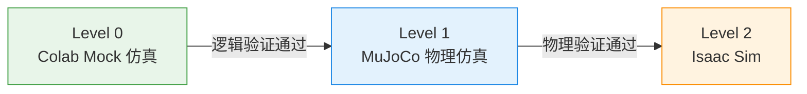

# 在线演示

本页面汇总了可直接在浏览器中运行的 Colab 交互式演示。点击 badge 即可在 Google Colab 中打开并运行。

---

## MuJoCo 物理仿真演示

基于 MuJoCo 物理引擎的 CR5 机械臂仿真演示，包含：

- 多角度场景渲染（Home / Reset / Target 三种预设姿态）
- 四视角正交视图（正面 / 侧面 / 俯视 / 透视）
- 器械托盘特写
- Reset -> Target 运动动画（视频播放）
- DH-3 夹爪开合动画
- 完整模型参数报告

!!! info "运行环境"
    纯 CPU 即可运行，无需 GPU。首次运行需安装 `mujoco` 和 `mediapy`，约 1 分钟。

**相关文档**: [MuJoCo 仿真方案](../modules/simulation/mujoco_proposal.md)

---

## v2 固定位置模式 Mock 仿真

v2 固定位置模式的逻辑仿真（Mock 级别），包含：

- 语音指令解析流程
- 器械坐标查找与路径规划
- 抓取-递送-归还三阶段状态机
- 多器械轮换测试

!!! info "运行环境"
    纯 Python 逻辑仿真，无外部依赖，秒级完成。

**相关文档**: [v2 固定位置模式方案](../progress/v2_fixed_position.md)

---

## 仿真体系总览

| 级别 | 引擎 | 用途 | 状态 |
|------|------|------|------|
| Level 0 | Mock (Python) | 逻辑验证 / 快速迭代 | 已完成 |
| Level 1 | MuJoCo | 运动验证 / 力学仿真 | Phase A 已完成 |
| Level 2 | Isaac Sim | 高保真视觉 / Sim2Real | 进行中 |
