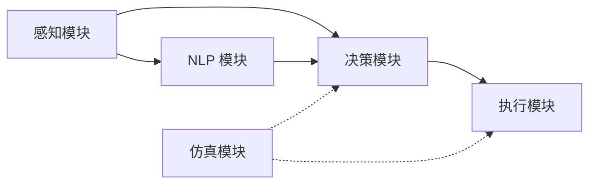

# 雄安手术器械护士机器人

欢迎访问**雄安宣武医院手术器械护士机器人**项目文档。

## 项目简介

本项目聚焦雄安宣武医院手术室场景，研发一款**手术器械护士辅助机器人**。机器人的定位是**配合器械护士和医生**，承担高频、标准化的器械识别、抓取和递交任务，减轻护士体力与注意力负担，提升手术流程的安全性和效率。

!!! note "核心定位"
    当前阶段**不是取代器械护士**，而是作为器械护士的辅助，配合护士和医生完成手术器械的管理与传递。

## 系统架构概览

| 模块 | 核心技术 | 负责人 |
|------|---------|--------|
| 感知模块 | YOLO 器械检测、相机标定、夹取点算法 | 李淑雅 |
| NLP 模块 | Qwen2.5-0.5B 器械名称识别（SFT + DPO） | 陈端端 |
| 决策模块 | OpenVLA 视觉-语言-动作模型 | 任松 |
| 执行模块 | 越疆 CR5 机械臂控制、安全策略 | 全员协作 |
| 仿真模块 | Isaac Sim + Omniverse 虚拟手术室 | 谭文韬 |

## 快速导航

- [项目简介](overview/introduction.md) - 项目背景与目标
- [系统架构](overview/architecture.md) - 技术架构设计
- [人机协同方案](overview/human_robot_collab.md) - 机器人与护士如何配合
- [2026年2月现场测试](progress/field_test_202602.md) - 最新测试问题总结
- [操作指南](guides/git_quickstart.md) - Git 入门与协作规范
