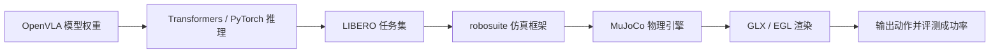

# 决策模块

## 概述

决策模块是系统的"大脑"，基于 **OpenVLA (Vision-Language-Action)** 模型，接收图像与任务指令输入，输出机器人动作序列。通过 LIBERO 仿真任务集进行评测验证。

## 技术链路

## 四层架构

| 层次 | 组件 | 职责 |
|------|------|------|
| 模型层 | OpenVLA, PyTorch, Transformers, flash-attn | 模型加载、推理 |
| 任务层 | LIBERO (130 个任务, 4 个 task suite) | 任务定义与评测标准 |
| 仿真层 | robosuite, MuJoCo | 机器人仿真、物理引擎 |
| 渲染层 | GLX / EGL | 图形渲染，生成图像输入 |

## 当前状态

!!! success "阶段性成果"
    OpenVLA + LIBERO + robosuite + MuJoCo 的完整技术链路已基本跑通。libero_spatial 评测可正常运行，已进入"功能是否稳定、能否形成基线并向真实机械臂迁移"的阶段。

## 负责人

任松（决策/感知全链路）、谭文韬（仿真部署）

## 子页面

- [OpenVLA 进展](openvla_progress.md)
- [LIBERO 仿真评测](libero_eval.md)
- [数据流水线](data_pipeline.md)
