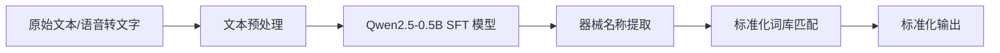

# NLP 模块

## 概述

NLP 模块负责从语音指令或文本中准确识别医疗器械名称，并输出标准化结果。基于 **Qwen2.5-0.5B** 模型，通过 SFT 监督微调和 DPO 直接偏好优化两个阶段进行训练。

## 核心目标

解决院内医疗文本处理中器械名称识别不精准、输出不规范等问题，支撑：

- 语音指令中的器械名称提取
- 器械台账文本匹配
- 病历文本中的器械实体识别

## 技术路线

## 训练流程

1. **数据集建设**：覆盖约 500 条医疗文本，整理标准化器械词库（JSON 格式）
2. **SFT 监督微调**：使用 LlamaFactory + LoRA 轻量化微调
3. **DPO 偏好优化**：解决误识别、冗余输出、幻觉等问题
4. **模型部署**：使用 vLLM 部署推理服务

## 负责人

陈端端

## 子页面

- [Qwen2.5 SFT 微调](qwen_sft.md)
- [DPO 对齐优化](dpo_alignment.md)
- [器械标准化词库](instrument_vocab.md)
