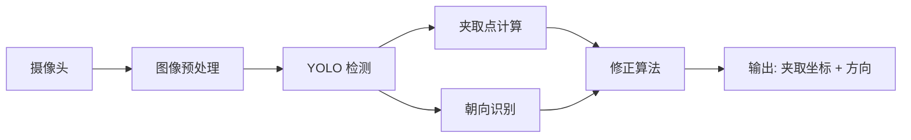

# 感知模块

## 概述

感知模块负责手术器械的视觉识别与定位，是整个系统的"眼睛"。主要包含三个子功能：

1. **YOLO 器械检测** - 基于深度学习的目标检测，识别器械种类和位置
2. **相机标定** - 手眼标定，实现图像坐标到机械臂坐标的映射
3. **夹取点算法** - 计算器械的最佳夹取位置和方向

## 模块架构

## 当前状态

!!! info "v2 方案影响"
    v2 固定位置模式下，感知模块的 YOLO 检测和手眼标定为**可选**功能。固定位置模式完全绕过感知链路，直接使用示教配置坐标。YOLO 模式保留为切换选项，支持未来精度提升后回归。详见：[v2 固定位置模式方案](../../progress/v2_fixed_position.md)

- YOLO 器械检测：基本可用，但存在误识别问题（如将托盘外物体识别为器械）
- 手眼标定：流程可行但繁琐（约1小时/次），需优化为半自动化
- 夹取点算法：需要开发修正算法，结合识别框、夹取点和朝向点综合计算

## 负责人

李淑雅 - 主要负责图像识别和夹取点算法

## 子页面

- [YOLO 器械检测](yolo_detection.md)
- [相机标定](camera_calibration.md)
- [夹取点算法](grasp_algorithm.md)

---

## 待决策问题

!!! question "需要团队讨论确定"

| 编号 | 问题 | 备选方案 | 状态 |
|------|------|---------|------|
| D-PC-01 | 是否引入二维码辅助识别方案？ | A: 纯视觉识别 / B: 二维码标签辅助 / C: 混合方案 | ⬚待讨论 |
| D-PC-02 | 两个俯视摄像头是否分离部署（一个看托盘，一个看递交区）？ | A: 双摄同结构 / B: 功能分离部署 | ⬚待讨论 |

## 已知瓶颈

!!! warning "当前阻碍进展的问题"

| 瓶颈 | 影响 | 关联问题 | 缓解方向 |
|------|------|---------|---------|
| 托盘外物体误识别 | 非目标物体被检测为器械，干扰夹取 | [ISS-05](../../progress/issue_tracker.md) | 增加 ROI 区域过滤 + 提高置信度阈值 |
| 手眼标定耗时约 1 小时 | 每次部署需重新标定，效率低 | [ISS-01](../../progress/issue_tracker.md) | 开发半自动标定工具 |
| 夹取点修正算法缺失 | 识别框偏差直接影响夹取成功率 | [ISS-04](../../progress/issue_tracker.md) | 结合检测框 + 朝向 + 深度信息综合修正 |

## 本周行动

> 更新日期：2026-03-18

- [ ] 优化 YOLO 检测模型，降低托盘外误识别率
- [ ] 调研半自动标定方案，评估可行性
- [ ] 设计夹取点修正算法原型
