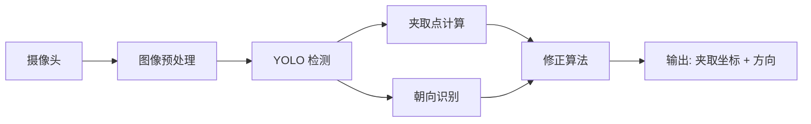

# 感知模块

## 概述

感知模块负责手术器械的视觉识别与定位，是整个系统的"眼睛"。主要包含三个子功能：

1. **YOLO 器械检测** - 基于深度学习的目标检测，识别器械种类和位置
2. **相机标定** - 手眼标定，实现图像坐标到机械臂坐标的映射
3. **夹取点算法** - 计算器械的最佳夹取位置和方向

## 模块架构

## 当前状态

- YOLO 器械检测：基本可用，但存在误识别问题（如将托盘外物体识别为器械）
- 手眼标定：流程可行但繁琐（约1小时/次），需优化为半自动化
- 夹取点算法：需要开发修正算法，结合识别框、夹取点和朝向点综合计算

## 负责人

李淑雅 - 主要负责图像识别和夹取点算法

## 子页面

- [YOLO 器械检测](yolo_detection.md)
- [相机标定](camera_calibration.md)
- [夹取点算法](grasp_algorithm.md)
