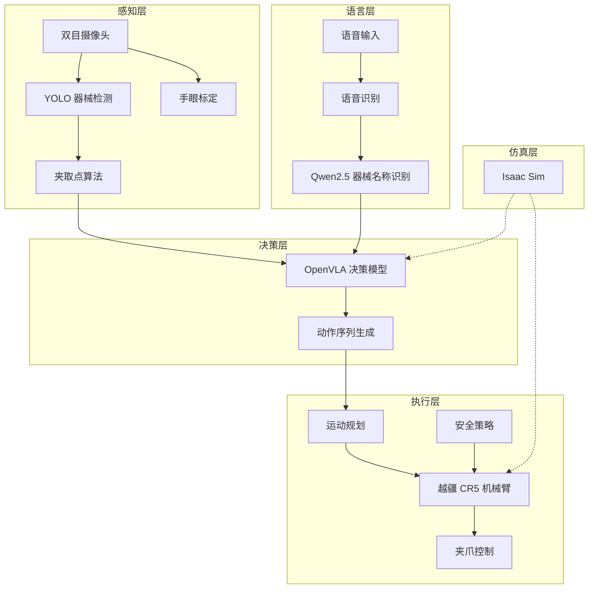
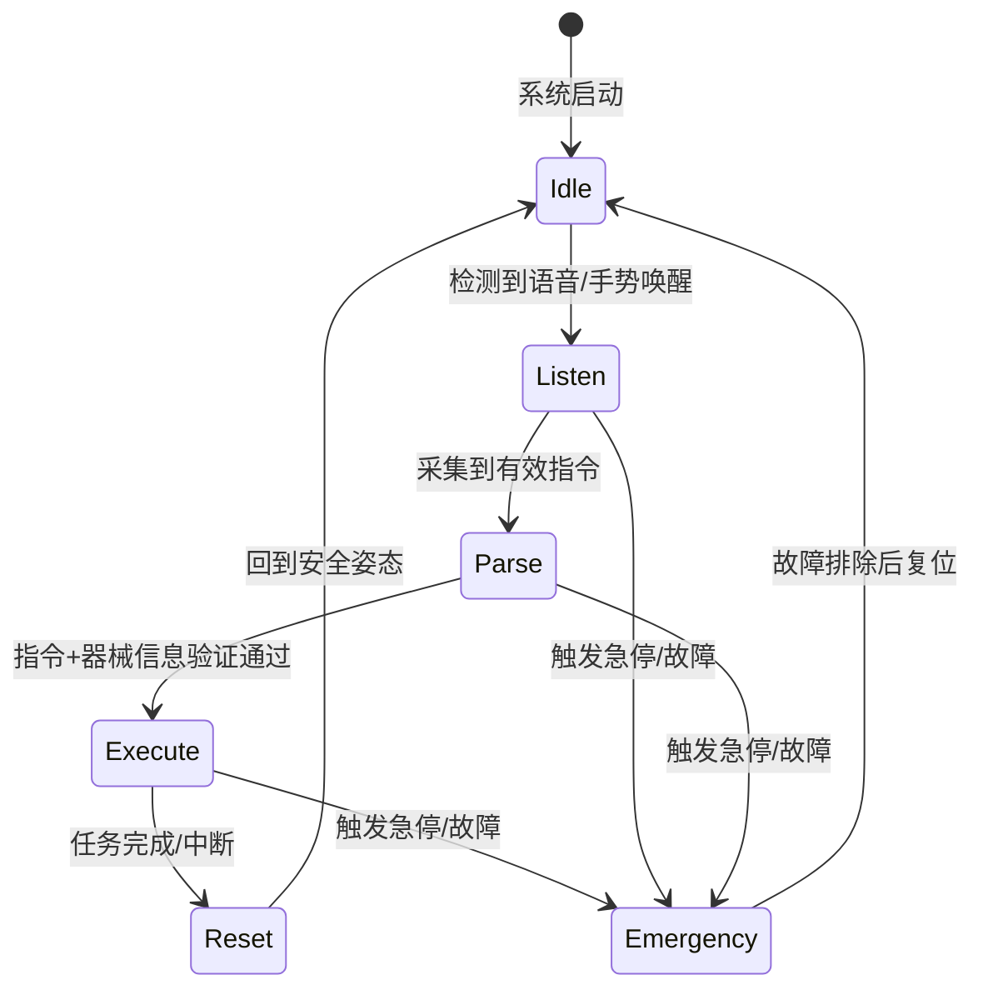

# 系统架构

## 总体架构

系统由五大模块组成，形成从感知到执行的完整闭环：



## 模块职责

### 感知模块

- YOLO 目标检测：识别器械种类、位置
- 相机标定：手眼标定实现像素坐标到机械臂坐标的转换
- 夹取点算法：计算修正后的夹取位置和方向

### NLP 模块

- 基于 Qwen2.5-0.5B 微调的医疗器械实体识别模型
- 支持从语音转文字中提取器械名称并标准化输出

### 决策模块

- OpenVLA (Vision-Language-Action) 视觉-语言-动作模型
- 接收图像和任务指令，输出机器人动作序列
- LIBERO 仿真评测验证决策效果

### 执行模块

- 越疆 CR5 协作机械臂控制
- 运动规划与轨迹生成
- 安全策略（急停、碰撞检测、力反馈）

### 仿真模块

- Isaac Sim + Omniverse 构建虚拟手术室
- 支持 sim2real 迁移验证

## 数据流

```
语音指令 / 手动触发
       │
       ▼
  NLP 器械名称识别
       │
       ▼
  视觉感知（器械定位 + 夹取点计算）
       │
       ▼
  VLA 决策（生成动作序列）
       │
       ▼
  运动规划 → 机械臂执行 → 器械递交
       │
       ▼
  医生确认取走 → 完成
```

## 通信架构

| 接口 | 方式 | 说明 |
|------|------|------|
| 摄像头 → 感知 | USB / GigE | RGB-D 图像流 |
| 感知 → 决策 | Python API | 器械位置、夹取点坐标 |
| NLP → 决策 | Python API | 器械名称、标准化结果 |
| 决策 → 执行 | Python SDK | 目标坐标、动作序列 |
| 执行 → 机械臂 | Dobot SDK (TCP) | 关节角 / 末端位姿指令 |

## 程序框架结构

系统采用**分层架构**设计，自底向上分为硬件驱动层、功能模块层、核心控制层，各层职责清晰、接口明确。

```
surgical_robot_cr5af/
├── .vscode/                # VS Code 远程调试 / 任务配置
├── hardware/               # 硬件驱动层
│   ├── cr5af_arm.py        # 机械臂 SDK 封装
│   ├── camera_driver.py    # 双目 / 3D 相机驱动
│   ├── microphone_driver.py # 麦克风 / 语音采集驱动
│   ├── gripper_driver.py   # 末端夹爪驱动
│   └── hand_eye_calib.py   # 半自动化手眼标定
├── modules/                # 功能模块层
│   ├── perception/         # 感知模块（YOLO + 二维码验证）
│   ├── nlp/                # 语音指令解析模块
│   ├── decision/           # 决策 / 任务调度模块
│   ├── execution/          # 运动执行模块
│   └── simulation/         # 仿真模块
├── core/                   # 核心控制层
│   ├── state_machine.py    # 状态机
│   ├── config.py           # 全局配置
│   ├── logger.py           # 日志模块
│   └── safety_manager.py   # 安全管理
├── tests/                  # 单元 / 集成测试
└── main.py                 # 程序入口
```

| 层级 | 目录 | 说明 |
|------|------|------|
| 硬件驱动层 | `hardware/` | 封装底层 SDK 通信，屏蔽硬件差异，上层不直接调用原始 SDK |
| 功能模块层 | `modules/` | 各模块为独立 Python 包，可单独测试和替换 |
| 核心控制层 | `core/` | 状态机 + 全局配置 + 安全管理，统一编排所有模块 |
| 测试层 | `tests/` | 每个模块对应独立测试用例 |

!!! info "扩展方向"
    随着项目推进，硬件驱动层将补充 `hand_eye_calib.py`（半自动化标定）等文件，核心控制层将补充 `safety_manager.py`（多级安全管理），各功能模块也会进一步拆分子文件（如 `perception/qr_validator.py`、`execution/delivery_pose.py` 等）。

## 状态机设计

状态机是系统全局运行的核心控制逻辑。机械臂默认处于待机状态，只有收到有效指令才会动作，这与医疗场景的安全性要求高度匹配。



| 状态 | 触发条件 | 主要动作 | 退出条件 |
|------|---------|---------|----------|
| Idle（待机） | 系统启动 / 复位完成 | 机械臂保持安全姿态，低功耗监听 | 语音或手势唤醒信号 |
| Listen（监听） | 唤醒信号触发 | 麦克风采集声音，视觉检测指令手势 | 采集到有效指令 |
| Parse（解析） | 有效指令输入 | NLP 解析器械名称，视觉确认器械位置，生成运动路径 | 指令和器械信息验证通过 |
| Execute（执行） | 路径规划完成 | 调用 CR5AF SDK 完成夹取、递送、归位，全程力控防碰撞 | 任务完成或中断 |
| Reset（复位） | 任务完成 / 中断 | 机械臂回到待机姿态 | 到达安全姿态 |
| Emergency（急停） | 碰撞 / 故障 / 急停信号 | 立即停止运动，进入安全模式 | 故障排除后手动复位 |

!!! warning "异常转移"
    Listen、Parse、Execute 三个状态均可在检测到急停信号或故障时直接跳转到 Emergency 状态。安全机制详见 [安全策略](../modules/execution/safety_strategy.md)。

## 模块解耦设计

系统通过三层解耦架构实现模块的独立开发、独立测试和灵活替换。

### 硬件驱动层

仅负责底层通信，封装越疆 SDK 的 `move_joint`、`move_line`、`set_force` 等接口。上层模块不直接调用 SDK，而是调用这个封装层，从而屏蔽硬件细节。详见 [CR5 控制接口](../modules/execution/dobot_cr5_control.md)。

### 功能模块层

每个模块（感知、NLP、决策、执行、仿真）是独立的 Python 包，模块间通过定义好的接口通信。例如更换语音识别模型时，只需替换 `modules/nlp/` 下的代码，不影响感知或执行模块。

### 核心控制层

状态机和全局配置是核心控制层的核心，保证所有模块遵循统一的状态流转和参数规范。安全管理模块负责全局的碰撞检测、急停响应和权限控制。

!!! tip "设计原则"
    模块间通过接口通信，不直接引用内部实现。任何模块可被等价替换而不影响其他模块。这与传统嵌入式开发的紧耦合模式截然不同，更适合多人协作和迭代优化。
