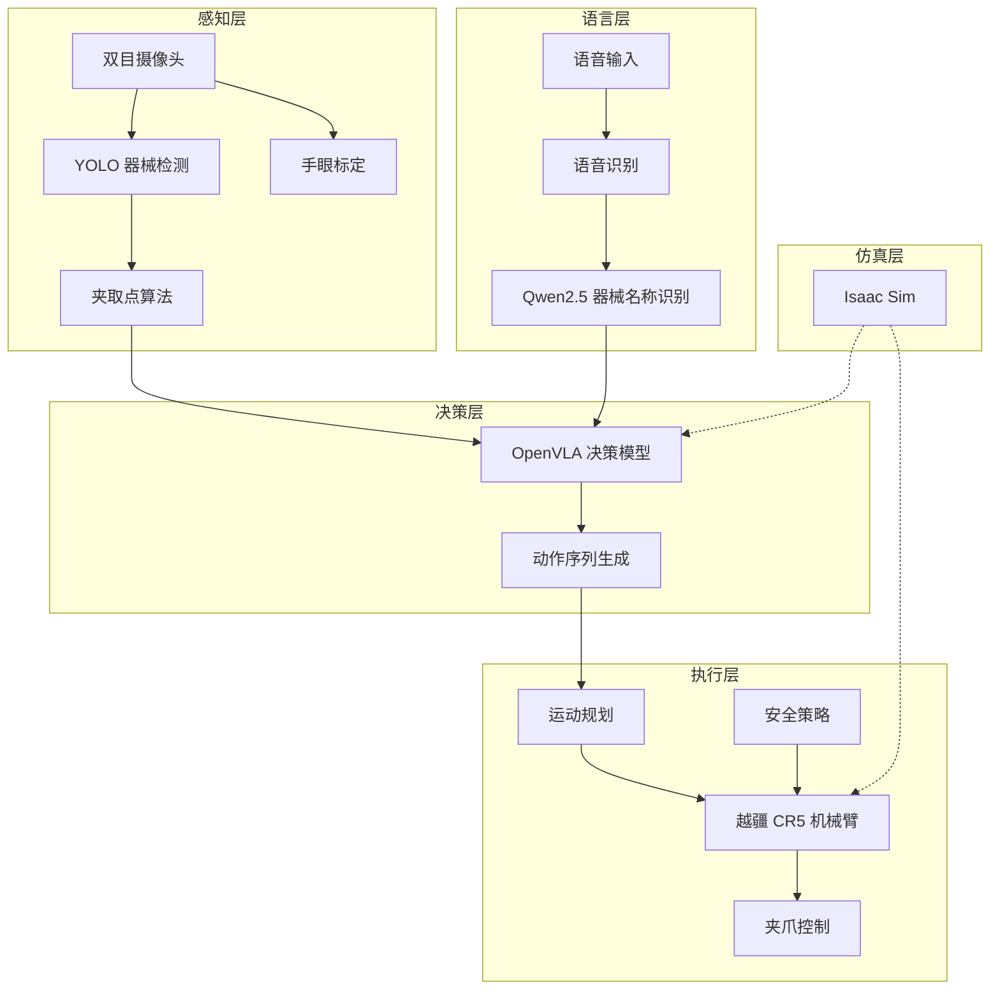

# 系统架构

## 总体架构

系统由五大模块组成，形成从感知到执行的完整闭环：



## 模块职责

### 感知模块

- YOLO 目标检测：识别器械种类、位置
- 相机标定：手眼标定实现像素坐标到机械臂坐标的转换
- 夹取点算法：计算修正后的夹取位置和方向

### NLP 模块

- 基于 Qwen2.5-0.5B 微调的医疗器械实体识别模型
- 支持从语音转文字中提取器械名称并标准化输出

### 决策模块

- OpenVLA (Vision-Language-Action) 视觉-语言-动作模型
- 接收图像和任务指令，输出机器人动作序列
- LIBERO 仿真评测验证决策效果

### 执行模块

- 越疆 CR5 协作机械臂控制
- 运动规划与轨迹生成
- 安全策略（急停、碰撞检测、力反馈）

### 仿真模块

- Isaac Sim + Omniverse 构建虚拟手术室
- 支持 sim2real 迁移验证

## 数据流

```
语音指令 / 手动触发
       │
       ▼
  NLP 器械名称识别
       │
       ▼
  视觉感知（器械定位 + 夹取点计算）
       │
       ▼
  VLA 决策（生成动作序列）
       │
       ▼
  运动规划 → 机械臂执行 → 器械递交
       │
       ▼
  医生确认取走 → 完成
```

## 通信架构

| 接口 | 方式 | 说明 |
|------|------|------|
| 摄像头 → 感知 | USB / GigE | RGB-D 图像流 |
| 感知 → 决策 | Python API | 器械位置、夹取点坐标 |
| NLP → 决策 | Python API | 器械名称、标准化结果 |
| 决策 → 执行 | Python SDK | 目标坐标、动作序列 |
| 执行 → 机械臂 | Dobot SDK (TCP) | 关节角 / 末端位姿指令 |
