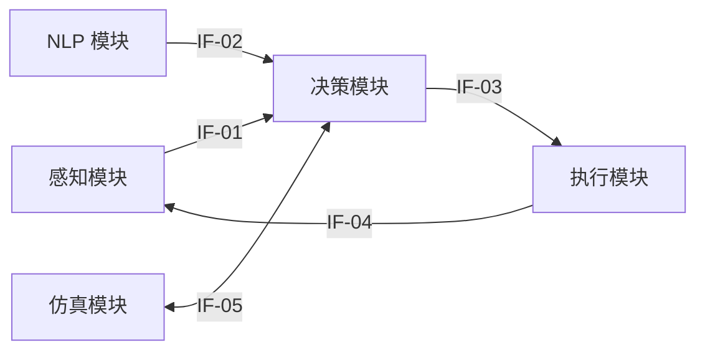

# 模块接口规范

## 概述

本页面定义 SurgBot 系统五大模块之间的数据接口，作为模块独立开发的契约文档。各模块开发时需严格遵守接口格式和传输约定，接口变更须在本页面同步更新。

## 接口关系图

## 接口总览

| 接口编号 | 接口名称 | 上游模块 | 下游模块 | 数据格式 | 传输方式 | 频率/触发条件 |
|---------|---------|---------|---------|---------|---------|-------------|
| IF-01 | 感知 → 决策 | 感知 | 决策 | RGB 图像 + 检测框 JSON | ROS Topic / 共享内存 | 10 Hz |
| IF-02 | NLP → 决策 | NLP | 决策 | 器械名称 JSON | REST API / 函数调用 | 语音指令事件触发 |
| IF-03 | 决策 → 执行 | 决策 | 执行 | 动作指令（7-DoF / 6-DoF + 夹爪） | TCP Socket / Python SDK | 事件触发 |
| IF-04 | 执行 → 感知 | 执行 | 感知 | 机械臂状态 | ROS TF / Dobot SDK 回调 | 实时 |
| IF-05 | 仿真 ↔ 决策 | 仿真 | 决策 | gym 观测 / 动作 | gym API | 按 episode |

## 接口详情

### IF-01: 感知 → 决策（图像 + 检测结果）

| 字段 | 说明 |
|------|------|
| **数据内容** | RGB 图像帧 + YOLO 检测框列表 |
| **检测框字段** | `bbox`, `class_id`, `confidence`, `grasp_point`, `orientation` |
| **数据格式** | ROS Image Topic + 自定义 JSON / 共享内存结构体 |
| **频率** | 10 Hz（摄像头帧率） |
| **延迟约束** | ≤100ms（从图像采集到检测结果输出） |
| **前置条件** | 检测框必须包含 `grasp_point` 字段，`confidence` ≥ 0.8 |

参考：[感知模块概述](../modules/perception/index.md)

### IF-02: NLP → 决策（器械名称）

| 字段 | 说明 |
|------|------|
| **数据内容** | 标准化器械名称 |
| **JSON 结构** | `{"instrument_name": "...", "confidence": 0.95, "raw_text": "..."}` |
| **传输方式** | REST API 或 Python 函数调用 |
| **触发条件** | 语音指令事件 |
| **响应时间** | 目标 ≤1s（当前瓶颈约 5s，见 [ISS-09](../progress/issue_tracker.md)） |
| **前置条件** | `instrument_name` 须匹配标准化词库中的条目 |

参考：[NLP 模块概述](../modules/nlp/index.md)、[器械标准化词库](../modules/nlp/instrument_vocab.md)

### IF-03: 决策 → 执行（动作指令）

| 字段 | 说明 |
|------|------|
| **数据内容** | 7-DoF 关节角 或 6-DoF 末端位姿 + 夹爪开合指令 |
| **传输方式** | TCP Socket（端口 8080）/ Python SDK 调用 |
| **触发条件** | 决策模型输出事件 |
| **前置条件** | 目标位姿须通过安全校验（见 [系统安全约束](safety_constraints.md)） |

参考：[执行模块概述](../modules/execution/index.md)、[CR5 控制接口](../modules/execution/dobot_cr5_control.md)

### IF-04: 执行 → 感知（机械臂状态反馈）

| 字段 | 说明 |
|------|------|
| **数据内容** | 当前关节角、末端位姿、力传感器读数 |
| **传输方式** | ROS TF / Dobot SDK 回调函数 |
| **频率** | 实时（SDK 回调频率） |
| **用途** | 手眼标定校正、闭环位置补偿 |

参考：[CR5 控制接口](../modules/execution/dobot_cr5_control.md)

### IF-05: 仿真 ↔ 决策（仿真环境交互）

| 字段 | 说明 |
|------|------|
| **数据内容** | 观测（图像 + 机器人状态）/ 动作（7-DoF）/ 奖励 / 终止信号 |
| **接口规范** | OpenAI Gym API: `obs, reward, done, info = env.step(action)` |
| **频率** | 按 episode 运行 |
| **仿真后端** | Level 1: robosuite + MuJoCo / Level 2: Isaac Sim |

参考：[LIBERO 仿真评测](../modules/decision/libero_eval.md)、[Isaac Sim 环境搭建](../modules/simulation/isaac_sim_setup.md)

## 变更记录

| 日期 | 接口编号 | 变更内容 | 负责人 |
|------|---------|---------|--------|
| 2026-03-18 | 全部 | 初始版本，定义 IF-01 ~ IF-05 | 全员 |
