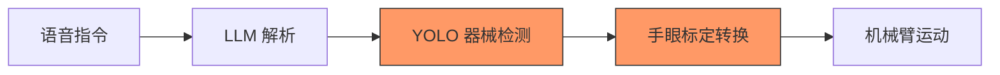
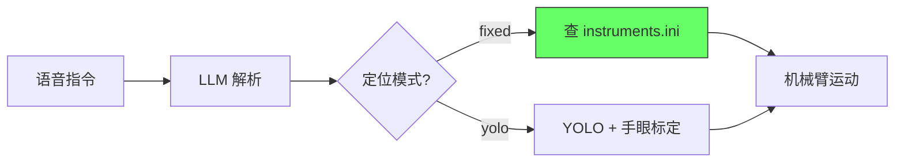

# v2 固定位置模式方案

[](https://colab.research.google.com/github/Zebedee2021/surgbot-docs/blob/main/notebooks/v2_simulation.ipynb)

!!! tip "活文档"
    本页面记录 v2 固定位置模式的技术方案与实现进展。**最近更新：2026-03-18**

> 状态：**方案设计完成，待实现** | 目标交付：2026-05-01

## 背景

2026年2月[现场测试](field_test_202602.md)暴露的核心问题（ISS-01/03/04/06）根源在于：**YOLO识别 + 手眼标定**的链路不稳定——标定耗时长、Z轴高度不一致、夹取点偏差大、器械识别容易混淆。

v2 方案采用**固定支架 + 示教位置**策略：器械放入固定槽位后一次示教录入坐标，后续直接读取配置文件中的精确坐标驱动机械臂，完全绕过 YOLO 检测和手眼标定环节。

## 核心思路

### 当前流程（v1）



### 新流程（v2 固定位置模式）



**关键改变**：固定位置模式下，从语音到运动的链路中**去掉了YOLO和手眼标定**两个最不稳定的环节。YOLO 模式保留为可选，通过配置切换。

## 解决的问题

| ISS 编号 | 问题 | v2 解决方式 | 预期效果 |
|---------|------|-----------|---------|
| [ISS-01](issue_tracker.md) | 手眼标定耗时 1 小时 | 示教工具一次录入，无需重复标定 | 标定时间从 1 小时降至 5 分钟 |
| [ISS-02](issue_tracker.md) | 参数修改需改代码 | instruments.ini 配置文件集中管理 | 无需改代码即可调参 |
| [ISS-03](issue_tracker.md) | Z 轴高度不一致 | 每个器械独立记录精确 Z 坐标 | 高度精确可控 |
| [ISS-04](issue_tracker.md) | 夹取点识别偏差 | 示教直接录入精确坐标，无识别误差 | 消除识别偏差 |
| [ISS-06](issue_tracker.md) | YOLO 识别错误 | 固定位置模式完全绕过 YOLO | 不依赖视觉识别 |

## 技术方案摘要

### 代码变更概览

在现有 RobotServer 上做**增量改进**，不推翻重来：

| 操作 | 文件 | 说明 |
|------|------|------|
| **新建** | `config/instruments.ini` | 器械固定位置注册表（位置、夹爪参数、模式切换） |
| **新建** | `bitRobot/service/TeachHandler.py` | 示教录入处理器，记录当前机械臂位置 |
| **新建** | `tools/teach_tool.py` | 独立 CLI 示教工具（拖拽模式录入位置） |
| **修改** | `bitRobot/service/RobotController.py` | handler() 新增固定位置分支 + robotMoveFixed() |
| **修改** | `bitRobot/service/llm/LLMService.py` | 支持器械别名 + "示教"指令 |
| **修改** | `bitRobot/service/robot_control/controller.py` | 新增 getCurrentTCPPosition() 方法 |
| **修改** | `bitRobot/constans/Constants.py` | 加载 instruments.ini 配置 |
| **修改** | `bitRobot/model/GlobalData.py` | 注册 TeachHandler 实例 |
| **修改** | `bitRobot/service/task/BaseTaskHandler.py` | 注册 "示教" handler |

**总改动量**：新增 3 文件（~250 行） + 修改 6 文件（~156 行），约 406 行代码变更。

### 配置文件格式

```ini
; config/instruments.ini

[mode]
locate_mode = fixed    ; "fixed" 或 "yolo"

[instruments]
mapping = {"0": "刀柄", "1": "镊子", "2": "剪刀", "3": "持针钳"}

[positions]
; 格式: id = [x, y, z, rz]（机械臂基坐标系）
0 = [250.5, -120.3, -85.2, 45.0]
1 = [280.1, -95.7, -82.0, 30.0]
2 = [310.3, -130.5, -80.5, 60.0]
3 = [340.0, -110.2, -83.0, 15.0]

[gripper]
; 格式: id = {"open": 开口, "close": 闭合, "force": 力}
0 = {"open": 400, "close": 20, "force": 800}
1 = {"open": 600, "close": 10, "force": 980}
2 = {"open": 500, "close": 40, "force": 550}
3 = {"open": 500, "close": 10, "force": 800}
```

### 示教录入流程

1. 运行 `python tools/teach_tool.py`
2. 机械臂进入拖拽模式（`StartDrag()` API）
3. 操作员手动拖动机械臂到器械上方
4. 按回车读取 TCP 笛卡尔坐标，保存为该器械的固定位置
5. 退出拖拽模式，写入 instruments.ini

## 五一演示目标

### 演示流程

```
1. 操作员部署器械支架，将 4 种器械放入固定槽位

2. 示教录入（一次性，约 5 分钟）：
   > python tools/teach_tool.py
   > 逐一示教 4 个器械位置 → 保存到 instruments.ini

3. 启动系统：
   > python main.py （RobotServer 启动，加载固定位置表）
   > 启动 RobotControl 客户端

4. 演示交互：
   医生（语音）: "传递镊子"
   → LLM 解析: 匹配"镊子" → id=1
   → RobotController: 查表得到固定坐标
   → 机械臂: 移动到位置 → 夹取 → 递送到交付点
   → 力反馈: 检测到医生拉力 → 松开夹爪
   → 客户端显示: "镊子已被取走"
   → 机械臂复位

5. 附加演示：
   "统计" → 扫描器械盘，报告器械数量
   "清点" → 与基准对比，检查完整性
   "取消" → 紧急停止并归还器械
```

### 验收标准

| 指标 | 目标 |
|------|------|
| 单器械拾取-递交全流程 | 10/10 成功 |
| 4 种器械轮换 | 成功率 > 90% |
| 单次流程耗时 | < 15 秒 |
| 指令响应延迟 | < 2 秒 |

## 实现进度

| 步骤 | 内容 | 状态 |
|------|------|------|
| Step 1 | instruments.ini + Constants 加载 | 待实现 |
| Step 2 | controller.py 新增 getCurrentTCPPosition() | 待实现 |
| Step 3 | RobotController 固定位置模式分支 | 待实现 |
| Step 4 | LLMService 别名增强 | 待实现 |
| Step 5 | TeachHandler + 注册 | 待实现 |
| Step 6 | teach_tool.py CLI 工具 | 待实现 |
| Step 7 | 端到端联调 | 待实现 |

## 相关链接

- [全局问题追踪](issue_tracker.md)
- [2026年2月现场测试](field_test_202602.md)
- [执行模块](../modules/execution/index.md)
- [感知模块](../modules/perception/index.md)
- [里程碑](milestones.md)
